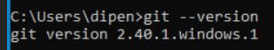
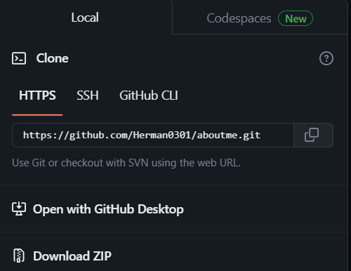


`	`**Мета роботи:** У даній лабораторній роботі нам потрібно ознайомитися із системою контролю git. Для цього нам треба буде інсталювати її собі на ПК та створити тестовий репозиторій, щоб ознайомитися із базовими принципами роботи.

`	`**Виконання роботи:**  

1. Спочатку реєструємося на GitHub. Після реєстрації та вказання своєї адреси пошти, а також паролю, ми успішно створюємо наш акаунт.

 

Рисунок 1.1 – Аватар, ім’я користувача 

Встановлюємо гит мануально та перевіряємо чи все працює

Перевіряємо вірність встановлення git.

Рисунок 1.2 – Перевірка версії git

`	`Git був встановлений коректно.

1. Зробимо глобальні налаштування git на нашому ПК, щоб він коректно розпізнавав наш обліковий запис. Це робиться двома командами.

git config --global user.name “Herman0301”

git config --global user.email d.s.herman@student.khai.edu

1. Далі потрібно згенерувати ключ для SSH доступу до репозиторію. Це робиться наступною командою:

ssh-keygen -t ed25519 -C " d.s.herman@student.khai.edu "

`	`Програма запропонує нам назвати ключ та за бажанням обрати директорію, відмінну від стандартної. Також можна задати пароль для даного ключа. Після створення ключа, у папці C:\Users\Rostok\.ssh потрібно знайти публічну версію даного ключа та додати її до GitHub. Це буде виглядати наступним чином.

Рисунок 1.3 – Доданий SSH ключ

1. Створимо новий репозиторій на сайті GitHub. Треба зробити його відкритим, а також назвати згідно нашого імені користувача, щоб він міг відображатися у профілі. Треба не забути додати Readme.md. Репозиторій виглядатиме приблизно наступним чином.

Рисунок 1.4 – Створений репозиторій

1. Скопіюємо SSH ключ із нашого репозиторію.

Рисунок 1.5 – Місцезнаходження ключа

Після підтвердження та обрання папки куди буде скопійований репозиторій, ми побачимо що все пройшло як потрібно, заповняємо усі данні

Рисунок 1.7 – Скопійований репозиторій та відредагований опис

Далі прописуємо такі команди в консоль

git add .

git commit 

git push

`	`На другій команді відкриється наш текстовий редактор і можна буде ввести коментар до commit.

1. Розглянемо отриманий результат.

Рисунок 1.8 – Результат роботи над README.md

Висновки

`	`Під час виконання цієї лабораторної роботи ми ознайомилися зі засобом контролю версій Git та веб-сервісом GitHub, набули практичних навичок використання основних команд Git для роботи з репозиторієм. Крім того, ми згенерували ключ SSH та додали його до нашого профілю на GitHub, щоб мати можливість аутентифікуватися на нашому комп'ютері. Завершивши роботу, ми створили короткий опис для нашого профілю.
